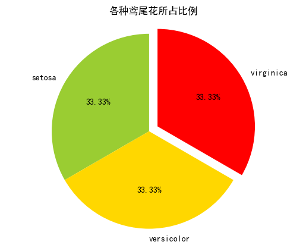
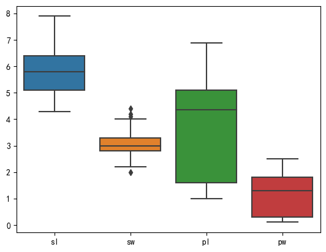
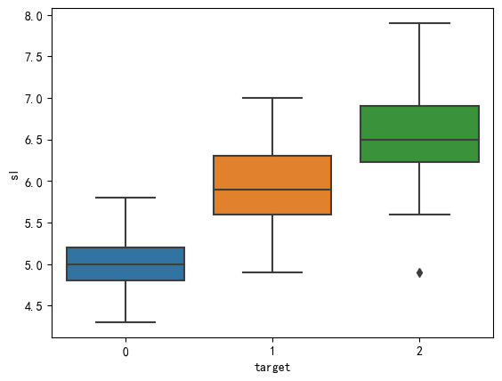
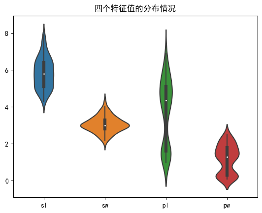
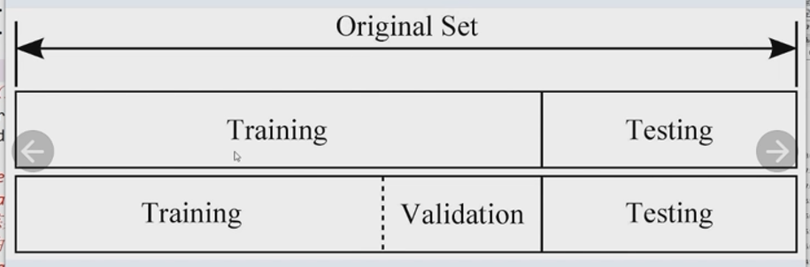

#### python机器学习

##### 用KNN算法实现鸢尾花分类

###### 数据处理

导库

```python
import numpy as np
import pandas as pd
import matplotlib.pyplot as plt
from sklearn.datasets import load_iris#鸢尾花数据集
import seaborn as sns#也用来绘图
from sklearn.model_selection import train_test_split#用来划分训练集和测试你集
from sklearn.preprocessing import StandardScaler#标准化处理
from sklearn.neighbors import KNeighborsClassifier#KNN算法
```

导入数据,分析数据

```python
iris=load_iris()
data=pd.DataFrame(iris.data)#得到data和target,都是一个numpy二维数组
target=pd.DataFrame(iris.target)
df=pd.concat((data,target),axis=1)#把data和target合并
df.columns=['sl','sw','pl','pw','target']#设置列名
df
```

<div>
<style scoped>
    .dataframe tbody tr th:only-of-type {
        vertical-align: middle;
    }

    .dataframe tbody tr th {
        vertical-align: top;
    }
    
    .dataframe thead th {
        text-align: right;
    }

</style>

<table border="1" class="dataframe">
  <thead>
    <tr style="text-align: right;">
      <th></th>
      <th>sl</th>
      <th>sw</th>
      <th>pl</th>
      <th>pw</th>
      <th>target</th>
    </tr>
  </thead>
  <tbody>
    <tr>
      <th>0</th>
      <td>5.1</td>
      <td>3.5</td>
      <td>1.4</td>
      <td>0.2</td>
      <td>0</td>
    </tr>
    <tr>
      <th>1</th>
      <td>4.9</td>
      <td>3.0</td>
      <td>1.4</td>
      <td>0.2</td>
      <td>0</td>
    </tr>
    <tr>
      <th>2</th>
      <td>4.7</td>
      <td>3.2</td>
      <td>1.3</td>
      <td>0.2</td>
      <td>0</td>
    </tr>
    <tr>
      <th>3</th>
      <td>4.6</td>
      <td>3.1</td>
      <td>1.5</td>
      <td>0.2</td>
      <td>0</td>
    </tr>
    <tr>
      <th>4</th>
      <td>5.0</td>
      <td>3.6</td>
      <td>1.4</td>
      <td>0.2</td>
      <td>0</td>
    </tr>
    <tr>
      <th>...</th>
      <td>...</td>
      <td>...</td>
      <td>...</td>
      <td>...</td>
      <td>...</td>
    </tr>
    <tr>
      <th>145</th>
      <td>6.7</td>
      <td>3.0</td>
      <td>5.2</td>
      <td>2.3</td>
      <td>2</td>
    </tr>
    <tr>
      <th>146</th>
      <td>6.3</td>
      <td>2.5</td>
      <td>5.0</td>
      <td>1.9</td>
      <td>2</td>
    </tr>
    <tr>
      <th>147</th>
      <td>6.5</td>
      <td>3.0</td>
      <td>5.2</td>
      <td>2.0</td>
      <td>2</td>
    </tr>
    <tr>
      <th>148</th>
      <td>6.2</td>
      <td>3.4</td>
      <td>5.4</td>
      <td>2.3</td>
      <td>2</td>
    </tr>
    <tr>
      <th>149</th>
      <td>5.9</td>
      <td>3.0</td>
      <td>5.1</td>
      <td>1.8</td>
      <td>2</td>
    </tr>
  </tbody>
</table>
<p>150 rows × 5 columns</p>
</div>

```python
target_names=iris.target_names#获取target标签,用于标志
target_names
```

    array(['setosa', 'versicolor', 'virginica'], dtype='<U10')

```python
df.corr()#列出比尔森相关系数
```

<div>
<style scoped>
    .dataframe tbody tr th:only-of-type {
        vertical-align: middle;
    }

    .dataframe tbody tr th {
        vertical-align: top;
    }
    
    .dataframe thead th {
        text-align: right;
    }

</style>

<table border="1" class="dataframe">
  <thead>
    <tr style="text-align: right;">
      <th></th>
      <th>sl</th>
      <th>sw</th>
      <th>pl</th>
      <th>pw</th>
      <th>target</th>
    </tr>
  </thead>
  <tbody>
    <tr>
      <th>sl</th>
      <td>1.000000</td>
      <td>-0.117570</td>
      <td>0.871754</td>
      <td>0.817941</td>
      <td>0.782561</td>
    </tr>
    <tr>
      <th>sw</th>
      <td>-0.117570</td>
      <td>1.000000</td>
      <td>-0.428440</td>
      <td>-0.366126</td>
      <td>-0.426658</td>
    </tr>
    <tr>
      <th>pl</th>
      <td>0.871754</td>
      <td>-0.428440</td>
      <td>1.000000</td>
      <td>0.962865</td>
      <td>0.949035</td>
    </tr>
    <tr>
      <th>pw</th>
      <td>0.817941</td>
      <td>-0.366126</td>
      <td>0.962865</td>
      <td>1.000000</td>
      <td>0.956547</td>
    </tr>
    <tr>
      <th>target</th>
      <td>0.782561</td>
      <td>-0.426658</td>
      <td>0.949035</td>
      <td>0.956547</td>
      <td>1.000000</td>
    </tr>
  </tbody>
</table>
</div>

###### 数据可视化

①饼图

```python
plt.rcParams['font.sans-serif'] = ['SimHei']#用plt.rcParams设置字体
counts=df['target'].value_counts() #返回结果按频数从大到小排列
x=[counts.iloc[0],counts.iloc[1],counts.iloc[2]]
labels=[target_names[0],target_names[1],target_names[2]]
colors=['yellowgreen','gold','#FF0000']
explode=(0,0,0.1)
plt.pie(x,explode=explode,labels=labels,colors=colors,autopct="%1.2f%%",startangle=90)
plt.title('各种鸢尾花所占比例')#fontpreperties已弃用
plt.axis('equal')
plt.show()
```



②用seaborn库绘图

盒图

iloc切换,第一个参数表示行,:表示所有行,第二个参数表示列,:4=0:4也就是第0-3列

```python
sns.boxplot(data=df.iloc[:,:4])
plt.show()
sns.boxplot(x=df['target'],y=df['sl'])
plt.show()
```





小提琴图

```python
ax=sns.violinplot(data=df.iloc[:,:4])
ax.set_title('四个特征值的分布情况')
plt.show()
```



###### 数据预处理

①分割训练集和测试集

```python
x_train,x_test,y_train,y_test=train_test_split(data,target,test_size=0.25 ,
random_state=0)
```

有时还会分割出验证集  

test_size=0.25 :指定测试集占25%,训练集就占75%  
random_state=0 :指定了随机种子,这样每次产生的训练集和测试集元素固定  
由于data,target均为DAtaFrame,所以x_train,x_test,y_train,y_test都是DataFrame,且y_train和y_test的秩为2

②对训练集和测试的特征数据进行标准化(标准化不一定是必须的)

```python
ss=StandardScaler()
x_train=ss.fit_transform(x_train)#求x_train的均值和标准差,然后转换数据
x_test=ss.transform(x_test)
```

ss.transform 用上一步算得的x_train的均值和标准差,来对x_test数据进行标准化.

③定义模型,进行训练

```python
knn=KNeighborsClassifier(n_neighbors=5)
knn.fit(x_train,y_train)
y_predict=knn.predict(x_test)
print(y_predict)
```

    [2 1 0 2 0 2 0 1 1 1 2 1 1 1 1 0 2 1 0 0 2 1 0 0 2 0 0 1 1 0 2 1 0 2 2 1 0
     2]
    
    
    c:\environment\python\lib\site-packages\sklearn\neighbors\_classification.py:207: DataConversionWarning: A column-vector y was passed when a 1d array was expected. Please change the shape of y to (n_samples,), for example using ravel().
      return self._fit(X, y)

提示了knnfit()的第二个参数要求是1个1维numpy数组,但传入的y_train是一个2维数组的DataFrame,可以使用y_train.values.ravel()

```python
knn.fit(x_train,y_train.values.ravel())
y_predict=knn.predict(x_test)
print(y_predict)
```

    [2 1 0 2 0 2 0 1 1 1 2 1 1 1 1 0 2 1 0 0 2 1 0 0 2 0 0 1 1 0 2 1 0 2 2 1 0
     2]

④结果评估

方法1:使用模型自带的评估函数进行准确性测评

```python
print(knn.score(x_test,y_test))
```

    0.9473684210526315

方法2:使用sklearn.metrics李的classification_report模块对预测结果做更详细的分析

```python
from sklearn.metrics import classification_report
print(classification_report(y_test,y_predict,target_names=target_names))
```

                  precision    recall  f1-score   support
    
          setosa       1.00      1.00      1.00        13
      versicolor       1.00      0.88      0.93        16
       virginica       0.82      1.00      0.90         9
    
        accuracy                           0.95        38
       macro avg       0.94      0.96      0.94        38
    weighted avg       0.96      0.95      0.95        38

方法3:使用混淆矩阵查看分类结果

```python
from sklearn.metrics import confusion_matrix
cm=confusion_matrix(y_test,y_predict)
print(cm)
```

    [[13  0  0]
     [ 0 14  2]
     [ 0  0  9]]

把y_test,y_predict合并在一块观察

```python
np.hstack((y_test.values,y_predict.reshape(-1,1)))
```

    array([[2, 2],
           [1, 1],
           [0, 0],
           [2, 2],
           [0, 0],
           [2, 2],
           [0, 0],
           [1, 1],
           [1, 1],
           [1, 1],
           [2, 2],
           [1, 1],
           [1, 1],
           [1, 1],
           [1, 1],
           [0, 0],
           [1, 2],
           [1, 1],
           [0, 0],
           [0, 0],
           [2, 2],
           [1, 1],
           [0, 0],
           [0, 0],
           [2, 2],
           [0, 0],
           [0, 0],
           [1, 1],
           [1, 1],
           [0, 0],
           [2, 2],
           [1, 1],
           [0, 0],
           [2, 2],
           [2, 2],
           [1, 1],
           [0, 0],
           [1, 2]])

##### 泰坦尼克号生还预测

##### 波士顿房价预测

##### 信用卡欺诈检测
